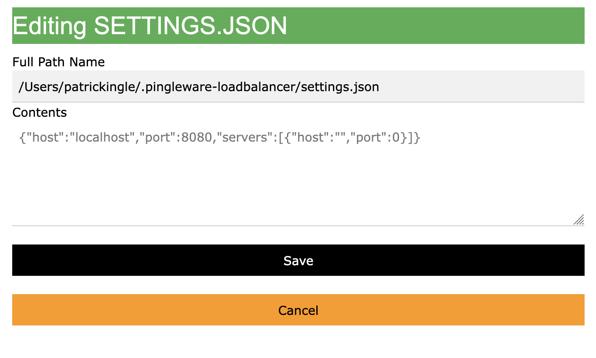
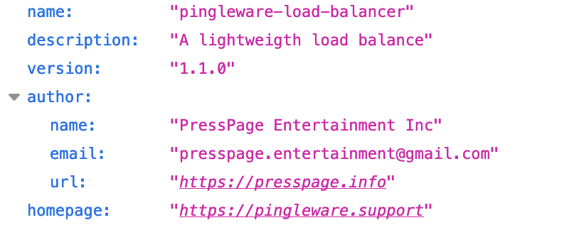
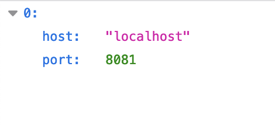

# pingleware-load-balancer

A load balance

The pingleware-load-balancer is a lightweight load balancer to quickly pass requests to the corresponding web servers.
The pingleware-load-balancer is based on the following,

    [https://thecodebarbarian.com/building-your-own-load-balancer-with-express-js](https://thecodebarbarian.com/building-your-own-load-balancer-with-express-js)

and

    [https://stackoverflow.com/questions/42156282/how-to-cluster-node-js-app-in-multiple-machines](https://stackoverflow.com/questions/42156282/how-to-cluster-node-js-app-in-multiple-machines)

# Installation

If not settings.json exists in the subdirectory of pingleware-loadbalance, then you will need to create this file from the web interface at

`http://localhost:8080/edit`



then add your servers in JSON format in the servers array. as below.

Pressing Save button will write a new settings.json file to the location specified. The .pingleware-loadbalancer directory is a system directory, to view system directories on Mac, press the SHIFT+COMMAND+PERIOD keys once to view all system directories in Finder and a second time to hide system directories.

The server will restart, enabling the proxy servers to handle requests.

### SETTINGS.JSON

The format expected,

```
{
    "host": "localhost",
    "port": 8080,
    "servers": [
        {
            "host": "localhost",
            "port": 8081
        },
        {
            "host": "localhost",
            "port": 8082
        },
        {
            "host": "localhost",
            "port": 8082
        }
    ]
}
```

## Routes

There are additional routes specified below.

### about

Describes the metatdata including version and support url.



### servers

List the proxy servers being served.


